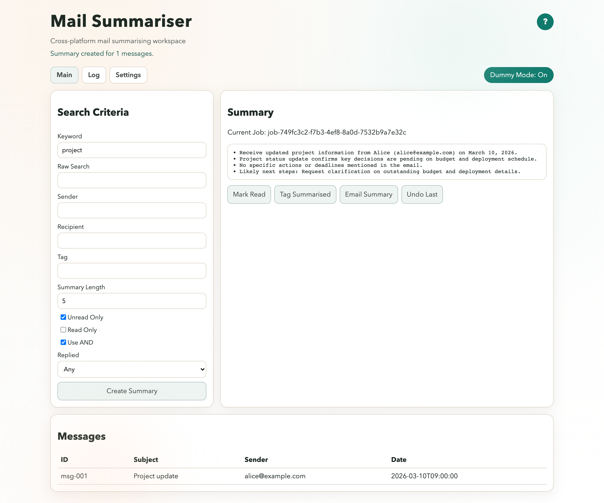
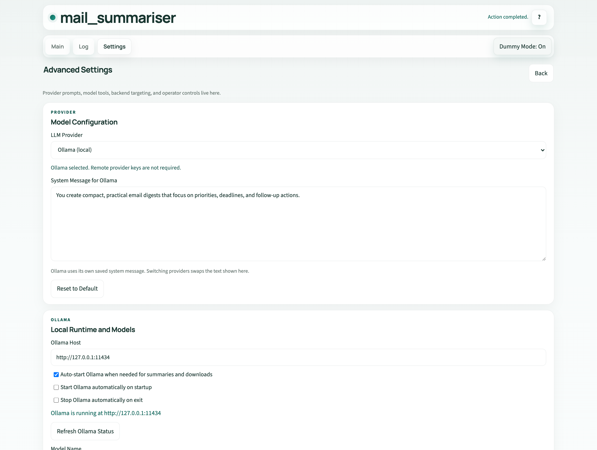
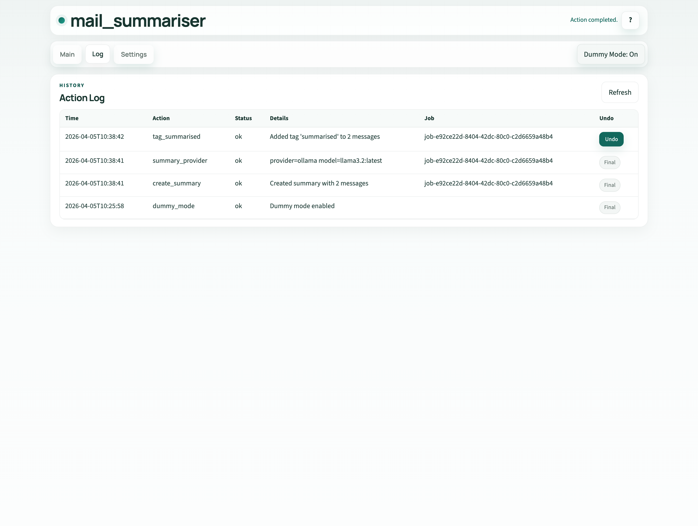

# mail_summariser

mail_summariser is a local-first mail workflow with a FastAPI backend, a browser client, and a SwiftUI macOS client. It can run entirely against a built-in dummy mailbox for safe validation, or switch to a real IMAP inbox and SMTP server while keeping persistent settings and live-mail history in SQLite.

The main workflow in both clients now keeps the returned messages in a list while opening the selected mail's sender, recipient, and body in a side-by-side detail pane.

User-facing docs, screenshots, and release downloads live on the GitHub Pages project site: [krahd.github.io/Mail-Summariser](https://krahd.github.io/Mail-Summariser/).

<p align="center">
  
</p>

<p align="center">
  
  
</p>

## Current product surface

- Browser client: `Main`, `Log`, `Settings`, and `Help`
- macOS client: `Main` and `Log` tabs, plus a separate Settings window
- Review flow: split message list plus selected-mail detail pane in both Main surfaces
- Mail modes: built-in dummy mailbox by default, real IMAP/SMTP when configured
- Summary providers: `ollama`, `openai`, or `anthropic`
- Ollama lifecycle controls: install/start prompts on startup, optional startup launch, optional stop-on-exit
- Follow-up actions: mark messages read, add the summarised tag, email the digest
- Persistence: SQLite for settings and live-mail jobs/logs/undo, plus an ephemeral dummy-mode sandbox
- Fallback behaviour: if provider output is unavailable or invalid, the backend falls back to a deterministic summary
- Model utilities: Ollama runtime checks, installed-model listing, downloadable catalogue browsing, and model download requests

## Repository layout

- `backend/`: FastAPI service, SQLite persistence, mail services, provider integration, summary logic
- `webapp/`: static browser client served by the backend at `/web`
- `macos-app/`: SwiftUI macOS client source
- `docs/`: GitHub Pages project site and screenshot assets
- `scripts/`: backend smoke tests, IMAP plan runner, and build scripts
- `tests/`: backend integration tests and web contract checks

## Quick start

Start the backend from the repository root:

```bash
./start_backend.sh
```

Then open:

- `http://127.0.0.1:8766/web` for the browser client
- `http://127.0.0.1:8766/docs` for FastAPI docs

The default path is dummy mode. You can create summaries, exercise follow-up actions, and inspect logs without touching a real mailbox. Dummy-mode jobs, logs, undo state, mailbox flags, and outbox are intentionally non-persistent and reset on backend restart or mode changes.

After each summary run, the first returned message is auto-selected so you can review the full mail body inline without leaving the summary view.

### macOS app

Open `mail_summariser.xcodeproj` in Xcode and run the `mail_summariser` scheme. The app talks to the backend service, so start the backend first unless you are pointing it at another running instance.

When the saved provider is `ollama`, both clients now check local Ollama status at startup:

- If Ollama is not installed, they offer to open the Ollama download page.
- If Ollama is installed but not running, they offer to start it using the saved `modelName`.
- If `ollamaStartOnStartup` is enabled, the backend starts Ollama automatically on boot and warms the saved model.
- If `ollamaStopOnExit` is enabled, the backend stops only the Ollama instance that mail_summariser itself started.

## Configuration

### Backend behaviour

- `ALLOWED_ORIGINS`: comma-separated CORS allowlist
- `API_KEY`: optional backend API key; when set, non-public API routes require it
- `API_KEY_HEADER`: auth header name, defaults to `X-API-Key`
- `MAIL_SUMMARISER_DATA_DIR`: override where SQLite data and logs are stored
- `MAIL_SUMMARISER_ENABLE_DEV_TOOLS`: enable the embedded fake IMAP/SMTP server controls

### Mail defaults

- `DUMMY_MODE`: `true` or `false`
- `IMAP_HOST`, `IMAP_PORT`, `IMAP_USE_SSL`, `IMAP_PASSWORD`
- `SMTP_HOST`, `SMTP_PORT`, `SMTP_USE_SSL`, `SMTP_PASSWORD`
- `MAIL_PASSWORD`: legacy shared mail password fallback for IMAP/SMTP
- `MAIL_USERNAME`
- `RECIPIENT_EMAIL`
- `SUMMARISED_TAG`

### Summary providers

- `LLM_PROVIDER`: `ollama`, `openai`, or `anthropic`
- `MODEL_NAME`
- `OLLAMA_HOST`
- `OLLAMA_AUTO_START`
- `OLLAMA_START_ON_STARTUP`
- `OLLAMA_STOP_ON_EXIT`
- `OPENAI_API_KEY`
- `ANTHROPIC_API_KEY`

Provider-specific environment variables take precedence over keys stored in SQLite settings.

`OLLAMA_AUTO_START` remains the request-time fallback for summaries and downloads. `OLLAMA_START_ON_STARTUP` controls proactive startup when the backend boots.

### Client defaults

- `BACKEND_BASE_URL`: default backend target the clients load into settings

## Data locations

- Source runs default to `backend/data/mail_summariser.sqlite3`
- Packaged runs default to `~/.mail-summariser/mail_summariser.sqlite3`
- `MAIL_SUMMARISER_DATA_DIR` overrides both

The Settings surfaces in both clients now also expose:

- `Reset Local Database`: clears all persisted settings, logs, jobs, and undo rows, then restores defaults
- `Fake Mail Server` when `MAIL_SUMMARISER_ENABLE_DEV_TOOLS=true`: starts a localhost IMAP/SMTP test account and can preload matching live-mail settings into the form

## Testing

Run the current automated test layers from the repo root:

```bash
python3 -m unittest discover -s tests -v
./scripts/smoke_test_backend.sh
./scripts/run_imap_test_plan.sh
xcodebuild -project mail_summariser.xcodeproj -scheme mail_summariser -configuration Debug CODE_SIGNING_ALLOWED=NO -derivedDataPath /tmp/mail-summariser-deriveddata test
```

`./scripts/smoke_test_backend.sh` now also verifies the runtime status endpoint, the fake-mail status endpoint, the expanded settings payload, and the database reset endpoint.

`./scripts/run_imap_test_plan.sh` runs the backend and web contract tests, a backend compile check, the HTTP smoke test, and the macOS Swift typecheck in one pass.

Supporting docs:

- [Testing strategy](docs/TESTING_STRATEGY.md)
- [IMAP test plan](docs/IMAP_TEST_PLAN.md)

## Build and release

Backend binaries are built per host platform:

```bash
python3 scripts/build_backend_binary.py --platform macos --arch arm64
python3 scripts/build_backend_binary.py --platform linux --arch x64
python3 scripts/build_backend_binary.py --platform windows --arch x64
```

Build the macOS app archive with:

```bash
./scripts/build_macos_app.sh
```

The release workflow publishes:

- backend binaries for macOS, Linux, and Windows
- packaged backend archives:
  - `mail-summariser-backend-macos-arm64.tar.gz`
  - `mail-summariser-backend-linux-x64.tar.gz`
  - `mail-summariser-backend-windows-x64.zip`
- `mail_summariser-macos-app.zip`

## Known limitations

- Windows and Linux releases currently ship the backend and browser UI, not native desktop apps.
- Installing Ollama still opens the official download page; mail_summariser does not perform unattended package installation.
- Provider-backed summaries can fall back to the built-in deterministic digest when a model is unavailable or returns invalid output.

## Contributing

Pull requests are welcome.

For larger changes, open an issue first so the scope and direction can be aligned before implementation.

## License

This project is released under the MIT License. See [LICENSE](LICENSE).

The software is provided "AS IS", without warranty of any kind, express or implied.
