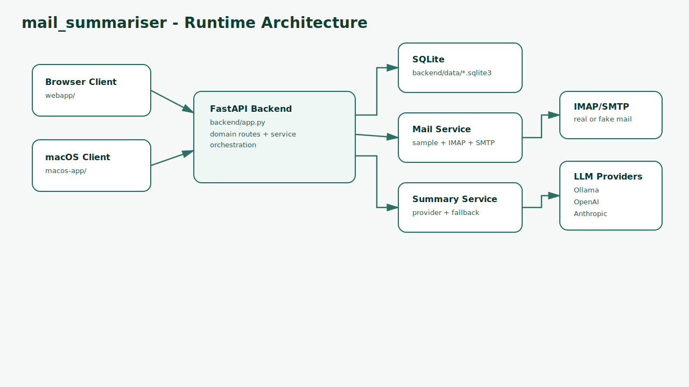
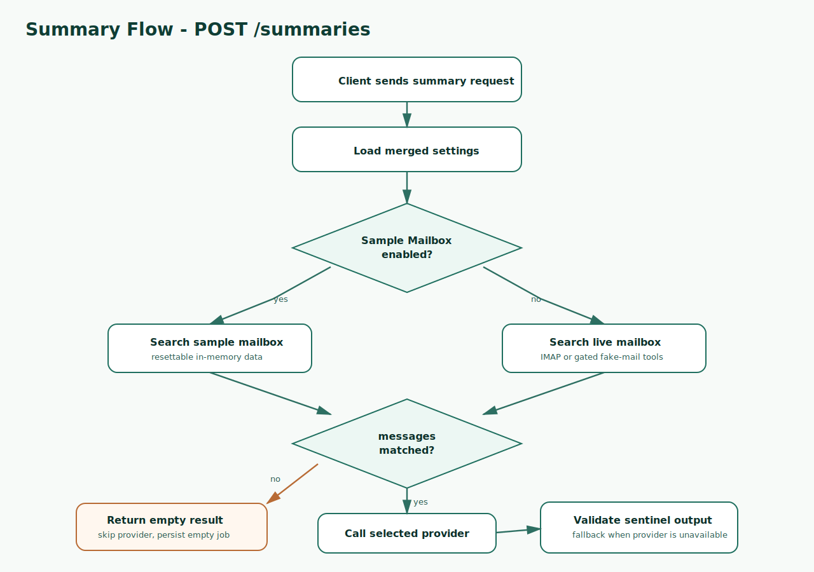

# mail_summariser – Project Status

Last updated: 2026-05-07 00:15
Last updated: 2026-05-06 17:37

## Project purpose

mail_summariser is a local-first email workflow with a FastAPI backend, a browser client, and a macOS SwiftUI client. It supports dummy-mode onboarding, live IMAP/SMTP workflows, provider-backed email summaries, and deterministic fallback summaries when model providers are unavailable or return invalid output.

## Current implementation state

The repository is organised around three active surfaces:

- FastAPI backend in `backend/`
- browser client in `webapp/`
- macOS SwiftUI client in `macos-app/`

Key runtime characteristics:

- API entrypoint: `backend/app.py`
- persistence: SQLite via `backend/db.py`
- mail modes: dummy in-memory mailbox, real IMAP/SMTP mailbox, and gated dev fake-mail server endpoints
- summary generation: provider abstraction in `backend/llm_provider_clients.py` and orchestration/fallback handling in `backend/summary_service.py`
- runtime model control: Ollama install/running checks and start/stop behaviour in `backend/model_provider_service.py`
- runtime/model route module: `backend/routers_runtime_models.py`

Route decomposition is implemented for runtime/model, settings, actions, summaries, and dev-tools routes. Repository hygiene checks guard against generated artefacts and migration remnants.

## Active focus

Current focus is maintaining a clean local-first workflow, preserving secret masking and safe dev-tool gating, keeping backend and clients aligned, and expanding validation around route decomposition, parser/input robustness, and full-stack startup behaviour.

## Architecture overview

The FastAPI backend owns persistence, settings, mail access, summary orchestration, provider integration, model runtime control, and route modules. The browser and macOS clients call the backend API. Tests and scripts validate backend behaviour, route registration, full-stack startup, repository hygiene, and malformed payload handling.

### Architecture diagram

<svg xmlns="http://www.w3.org/2000/svg" width="1040" height="470" viewBox="0 0 1040 470" role="img" aria-labelledby="mail-arch-title mail-arch-desc">
  <title id="mail-arch-title">mail_summariser architecture</title>
  <desc id="mail-arch-desc">Browser and macOS clients call FastAPI routes backed by mail services, SQLite persistence, summary providers, and runtime model control.</desc>
  <defs><marker id="arrow" viewBox="0 0 10 10" refX="9" refY="5" markerWidth="8" markerHeight="8" orient="auto"><path d="M0 0 L10 5 L0 10 z" /></marker></defs>
  <rect x="40" y="80" width="180" height="70" rx="10" fill="none" stroke="black" /><text x="130" y="110" text-anchor="middle" font-size="14">webapp/</text><text x="130" y="130" text-anchor="middle" font-size="12">browser client</text>
  <rect x="40" y="230" width="180" height="70" rx="10" fill="none" stroke="black" /><text x="130" y="260" text-anchor="middle" font-size="14">macos-app/</text><text x="130" y="280" text-anchor="middle" font-size="12">SwiftUI client</text>
  <rect x="300" y="145" width="210" height="90" rx="10" fill="none" stroke="black" /><text x="405" y="180" text-anchor="middle" font-size="14">backend/app.py</text><text x="405" y="202" text-anchor="middle" font-size="12">FastAPI app and</text><text x="405" y="220" text-anchor="middle" font-size="12">router mounting</text>
  <rect x="590" y="40" width="190" height="70" rx="10" fill="none" stroke="black" /><text x="685" y="70" text-anchor="middle" font-size="14">mail services</text><text x="685" y="90" text-anchor="middle" font-size="12">dummy, IMAP, SMTP</text>
  <rect x="590" y="145" width="190" height="70" rx="10" fill="none" stroke="black" /><text x="685" y="174" text-anchor="middle" font-size="14">summary service</text><text x="685" y="194" text-anchor="middle" font-size="12">provider fallback</text>
  <rect x="590" y="250" width="190" height="70" rx="10" fill="none" stroke="black" /><text x="685" y="280" text-anchor="middle" font-size="14">SQLite database</text><text x="685" y="300" text-anchor="middle" font-size="12">settings and state</text>
  <rect x="820" y="145" width="180" height="80" rx="10" fill="none" stroke="black" /><text x="910" y="176" text-anchor="middle" font-size="14">model providers</text><text x="910" y="198" text-anchor="middle" font-size="12">Ollama, OpenAI,</text><text x="910" y="216" text-anchor="middle" font-size="12">Anthropic, fallback</text>
  <rect x="590" y="360" width="190" height="70" rx="10" fill="none" stroke="black" /><text x="685" y="390" text-anchor="middle" font-size="14">tests/scripts</text><text x="685" y="410" text-anchor="middle" font-size="12">validation and hygiene</text>
  <line x1="220" y1="115" x2="300" y2="175" stroke="black" marker-end="url(#arrow)" /><line x1="220" y1="265" x2="300" y2="205" stroke="black" marker-end="url(#arrow)" /><line x1="510" y1="170" x2="590" y2="75" stroke="black" marker-end="url(#arrow)" /><line x1="510" y1="190" x2="590" y2="180" stroke="black" marker-end="url(#arrow)" /><line x1="510" y1="215" x2="590" y2="285" stroke="black" marker-end="url(#arrow)" /><line x1="780" y1="180" x2="820" y2="185" stroke="black" marker-end="url(#arrow)" /><line x1="685" y1="320" x2="685" y2="360" stroke="black" marker-end="url(#arrow)" />
</svg>

### Flow chart

<svg xmlns="http://www.w3.org/2000/svg" width="1040" height="350" viewBox="0 0 1040 350" role="img" aria-labelledby="mail-flow-title mail-flow-desc">
  <title id="mail-flow-title">mail_summariser summary flow</title>
  <desc id="mail-flow-desc">A client selects mail, backend loads messages, summary service calls a provider or fallback, and results are persisted and returned.</desc>
  <defs><marker id="flowarrow" viewBox="0 0 10 10" refX="9" refY="5" markerWidth="8" markerHeight="8" orient="auto"><path d="M0 0 L10 5 L0 10 z" /></marker></defs>
  <rect x="30" y="140" width="135" height="65" rx="10" fill="none" stroke="black" /><text x="97" y="168" text-anchor="middle" font-size="12">Client requests</text><text x="97" y="186" text-anchor="middle" font-size="12">summary</text>
  <rect x="210" y="140" width="135" height="65" rx="10" fill="none" stroke="black" /><text x="277" y="168" text-anchor="middle" font-size="12">Load mail</text><text x="277" y="186" text-anchor="middle" font-size="12">and settings</text>
  <rect x="390" y="140" width="135" height="65" rx="10" fill="none" stroke="black" /><text x="457" y="168" text-anchor="middle" font-size="12">Build summary</text><text x="457" y="186" text-anchor="middle" font-size="12">request</text>
  <rect x="570" y="140" width="135" height="65" rx="10" fill="none" stroke="black" /><text x="637" y="168" text-anchor="middle" font-size="12">Call provider</text><text x="637" y="186" text-anchor="middle" font-size="12">or fallback</text>
  <rect x="750" y="140" width="135" height="65" rx="10" fill="none" stroke="black" /><text x="817" y="168" text-anchor="middle" font-size="12">Persist result</text><text x="817" y="186" text-anchor="middle" font-size="12">in SQLite</text>
  <rect x="930" y="140" width="90" height="65" rx="10" fill="none" stroke="black" /><text x="975" y="168" text-anchor="middle" font-size="12">Return</text><text x="975" y="186" text-anchor="middle" font-size="12">JSON</text>
  <line x1="165" y1="172" x2="210" y2="172" stroke="black" marker-end="url(#flowarrow)" /><line x1="345" y1="172" x2="390" y2="172" stroke="black" marker-end="url(#flowarrow)" /><line x1="525" y1="172" x2="570" y2="172" stroke="black" marker-end="url(#flowarrow)" /><line x1="705" y1="172" x2="750" y2="172" stroke="black" marker-end="url(#flowarrow)" /><line x1="885" y1="172" x2="930" y2="172" stroke="black" marker-end="url(#flowarrow)" />
</svg>

## Setup and run instructions

Backend:

```bash
./start_backend.sh
```

Web app:

```bash
python -m http.server 8000 --directory webapp
```

Tests and validation:

```bash
pytest -q
./scripts/validate_full_stack.sh
python scripts/validate_full_stack.py
./scripts/check_repo_hygiene.sh
```

## Configuration and environment variables

- Runtime settings are persisted in SQLite, defaulting to `backend/data/mail_summariser.sqlite3`.
- Secrets are masked on reads from `/settings`.
- Writing masked sentinel values such as `__MASKED__` does not overwrite stored secrets.
- `MAIL_SUMMARISER_ENABLE_DEV_TOOLS` gates dev fake-mail endpoints.
- The project depends on external `modelito` helper utilities for LLM/model integration.

## Important files and directories

- `backend/`: FastAPI app, mail services, provider integration, SQLite persistence.
- `webapp/`: static browser UI.
- `macos-app/`: SwiftUI desktop client.
- `tests/`: pytest coverage.
- `scripts/`: build, release packaging, hygiene, and full-stack validation scripts.
- `.github/workflows/ci.yml`: CI validation matrix.

## Recent changes

- Runtime/model route decomposition is implemented in `backend/routers_runtime_models.py` and mounted in `backend/app.py`.
- Settings, actions, summaries, and dev-tools route decomposition is implemented through dedicated routers and `backend/router_context.py`.
- Repository hygiene guard is implemented through `scripts/check_repo_hygiene.sh` and CI.
- Full-stack validation scripts exist in shell and Python forms and are CI-enabled.
- Debug `print` calls in `backend/app.py` were replaced with logger-based messages.
- Router decomposition, router context, error paths, runtime/model endpoints, and malformed summary payload fuzzing have dedicated tests.

## Tests and verification status

Previously recorded validation includes:

- startup validation matrix on Linux, macOS, and Windows via CI
- route registration contract tests
- route-context resolution tests
- router error-path tests
- runtime/model endpoint smoke tests
- Hypothesis fuzzing for malformed `/summaries` payloads
- full-stack validation command exposed in scripts and VS Code tasks

No tests were run while creating this documentation-only status normalisation.

## Known issues, risks, and limitations

- Real IMAP/SMTP workflows involve sensitive credentials and real mailbox data.
- Dev fake-mail endpoints must remain disabled unless explicitly enabled.
- Settings masking semantics must not regress.
- Fuzzing currently covers summary payloads more deeply than settings/action payload contracts.

## Pending tasks

- Expand fuzzing to settings and action payload contracts.
- Continue keeping browser, backend, and macOS client assumptions aligned.
- Keep repository hygiene guards updated as build/release artefacts evolve.

## Next steps

1. Add malformed-input fuzz coverage for settings and action endpoints.
2. Run full-stack validation after the next backend/client integration change.
3. Keep route decomposition tests current when routes move.

## Longer-term steps

1. Maintain safe live-mail handling and secret masking as provider/model features expand.
2. Strengthen cross-platform client validation.
3. Keep local-first onboarding smooth through dummy mode and deterministic fallbacks.

## Decisions and rationale

- Dummy mode remains central for safe local onboarding and fast validation.
- Provider-backed summaries should degrade to deterministic fallback behaviour when providers fail.
- Dev tools must be explicit and gated.

---

Last updated: 2026-05-07 00:15
- Persistence: SQLite via `backend/db.py`
- Mail modes:
  - dummy in-memory mailbox
  - real IMAP/SMTP mailbox
  - dev fake-mail server endpoints (gated by `MAIL_SUMMARISER_ENABLE_DEV_TOOLS`)
- Summary generation:
  - provider abstraction in `backend/llm_provider_clients.py`
  - orchestration and fallback handling in `backend/summary_service.py`
- Runtime model control:
  - Ollama install/running checks and full admin behavior (install/start/stop/serve/list pullable/pull/delete) in `backend/model_provider_service.py`
  - all Ollama admin lifecycle operations now delegated through `modelito==1.2.2` APIs
  - runtime/model route module in `backend/routers_runtime_models.py`

## Cleanup performed

Removed stale or generated remnants from version control:

- migration-era docs:
  - `docs/MIGRATION_PR.md`
  - `docs/MIGRATION_TO_MODELITO.md`
- generated metadata:
  - `mail_summariser.egg-info/`
- generated build outputs:
  - `dist/`
- stale release logs:
  - `release_artifacts/`
- stale calibration output:
  - `calibration_report.json`
- low-value docs and site assets:
  - `docs/CALIBRATION.md`
  - `docs/IMAP_TEST_PLAN.md`
  - `docs/TESTING_STRATEGY.md`
  - `docs/index.html`, `docs/site.css`, `docs/site.js`
  - legacy screenshot assets under `docs/assets/*.png`
- low-value utility scripts and isolated calibration test:
  - `scripts/calibrate_timeout_catalog.py`
  - `scripts/run_imap_test_plan.sh`
  - `scripts/run_with_local_modelito.sh`
  - `scripts/test_workflows.sh`
  - `tests/test_calibration_cli.py`

Local-only remnants removed from workspace:

- `temp.txt`
- `modelito/` (cache-only residue)
- local cache folders (`.pytest_cache/`, `__pycache__/`)

Ignore rules strengthened in `.gitignore` for these artifact classes.

## Architecture diagram (SVG)



## Main request flow chart (SVG)



## Suggested-next-steps status

1. Route decomposition: implemented for runtime/model routes (`backend/routers_runtime_models.py`) and mounted in `backend/app.py`.
2. CI artifact/migration guard: implemented via `scripts/check_repo_hygiene.sh` and enabled in `.github/workflows/ci.yml`.
3. Runtime/model smoke tests: implemented in `tests/test_runtime_model_endpoints.py`.
4. Single full-stack validation command: implemented in `scripts/validate_full_stack.sh`, CI-enabled, and exposed in `.vscode/tasks.json`.
5. Structured diagnostics logging: debug `print` calls replaced with logger-based messages in `backend/app.py`.
6. Route decomposition (settings/actions/summaries/dev-tools): implemented via
  - `backend/routers_settings.py`
  - `backend/routers_actions.py`
  - `backend/routers_summaries.py`
  - `backend/routers_devtools.py`
  - shared module resolver in `backend/router_context.py`
7. Startup validation matrix: implemented in `.github/workflows/ci.yml` as
  `startup-validation-matrix` on `ubuntu-latest`, `macos-latest`, and
  `windows-latest` using cross-platform `scripts/validate_full_stack.py`.
8. Router decomposition regression guards: implemented via
  - `tests/test_router_decomposition.py` (route registration contract)
  - `tests/test_router_context.py` (top-level vs package app-module resolution)
9. Router error-path behavior coverage: implemented via
  - `tests/test_router_error_paths.py` for settings, summaries, actions, and
    dev-tools failure/404 paths.
10. Property-based parser/validation fuzzing: implemented via
  - `tests/test_fuzz_summary_payloads.py` using Hypothesis to stress malformed
    `/summaries` payload shapes and assert handled outcomes (`200`, `400`, `422`)
    without server crashes.
11. Cross-endpoint payload fuzzing hardening: implemented via
  - `tests/test_fuzz_settings_actions_payloads.py` using Hypothesis to fuzz
    malformed payload contracts for `/settings`, `/settings/test-connection`,
    `/settings/dummy-mode`, `/actions/mark-read`, `/actions/tag-summarised`,
    and `/actions/email-summary` with assertions that responses remain handled
    (`200`, `400`, `404`, `422`) and do not surface server crashes.
12. Targeted remaining-route fuzzing hardening: implemented via
  - `tests/test_fuzz_settings_actions_payloads.py` coverage for
    `/actions/undo`, `/actions/undo/logs/{log_id}`, `/logs` query shapes, and
    `/admin/database/reset` confirmation edge cases and malformed payloads.
13. Runtime/model malformed-contract fuzzing hardening: implemented via
  - `tests/test_fuzz_runtime_models_payloads.py` for `/runtime/status`,
    `/runtime/ollama/start`, `/runtime/shutdown`, `/models/options`, and
    `/models/catalog` query/body shape stress coverage.

## Remaining opportunities

1. Add property-based fuzzing for dev fake-mail endpoint payload/query contracts
  (`/dev/fake-mail/status`, `/dev/fake-mail/start`, `/dev/fake-mail/stop`) to
  complete malformed input hardening across all backend mutable/control routes.
